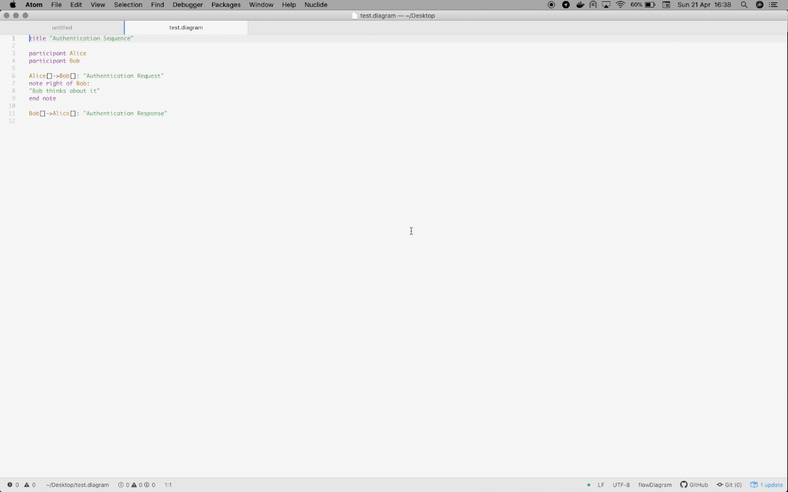
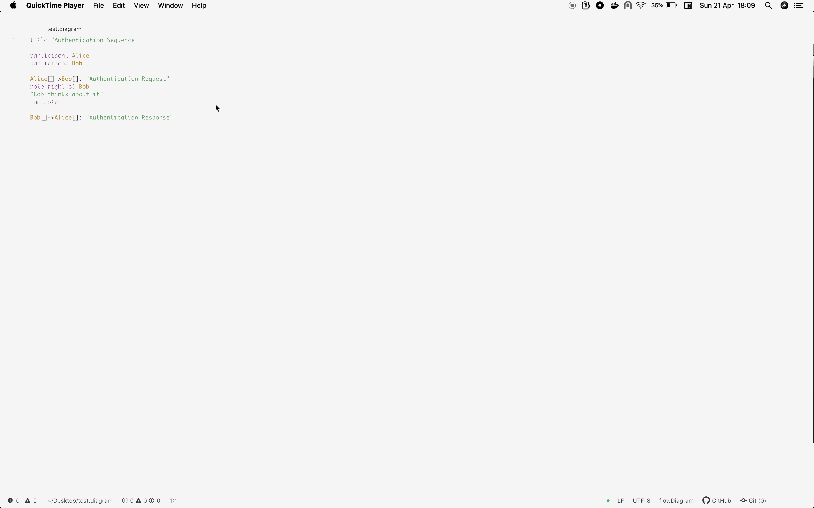

# flow-diagram package

This package is thought to allow people describe how entities interact between each other through [language-flow-diagram](https://atom.io/packages/language-flow-diagram) which was inspired by
[websequencediagrams](https://www.websequencediagrams.com/). Grammar definition is available at [language-flow-diagram](https://atom.io/packages/language-flow-diagram) page.

## Features

Currently the package offer

- **language-flow-diagram preview** : this functionality allows user to display the current diagram on a right side panel;
- **export** : user can export its diagram in the following formats : svg and pdf.

## Example

**Diagram preview**

After creating a \*.diagram file (diagram extension is mandatory); you can display its preview by selecting it from the menu, like the example below. The path is packages > flow-diagram > Diagram Preview

**Export to svg**

The flow-diagram package allows multiple export formats like svg.

